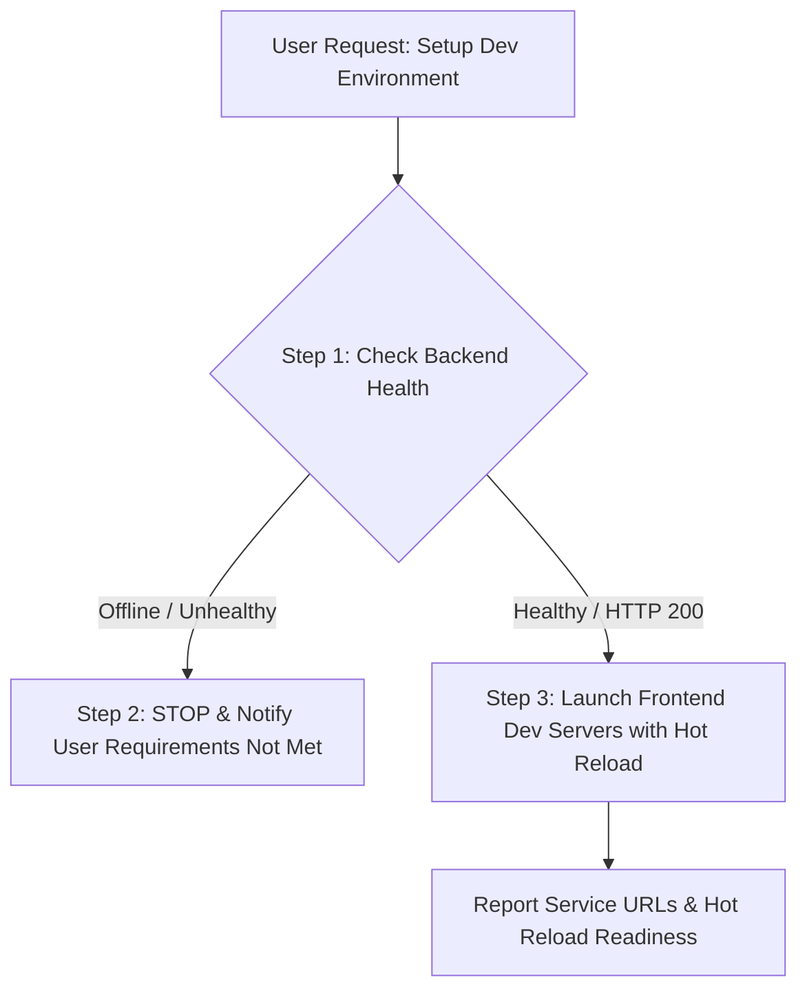

# Development Environment Setup Protocol

**Extracted:** 2026-09-14  
**Context:** Standard operating procedure for bootstrapping the local development environment upon user request (e.g., "siapkan lingkungan development", "setup dev environment", "start development mode").

## Problem
Starting frontend micro-frontends (`dashboard:4000`, `landing:4001`, `auth:4002`) when backend services (`gateway:3000`, `user-service`, `notification-service`, `mongodb`, `redis`, `rabbitmq`) are offline causes:
1. Cascading API connection failures and console error spam.
2. Broken authentication loops and failed cookie validations.
3. Unnecessary debugging of frontend code when the root failure is an unstarted backend stack.

## Solution

Always adhere to the three-step sequence whenever the user requests development environment setup:



### Step 1: Verify Backend Health Prerequisite
Check whether the local NestJS API Gateway and supporting infrastructure are running and healthy:

```bash
# Verify API Gateway health endpoint (HTTP GET)
curl.exe -s http://localhost:3000/health
```

Expected healthy response:
```json
{"status":"ok","realtime":true,"timestamp":"..."}
```

Alternatively, inspect Docker container health states:
```bash
docker ps --format "table {{.Names}}\t{{.Status}}\t{{.Ports}}"
```
All core services (`gateway`, `user-service`, `notification-service`, `mongodb`, `redis`, `rabbitmq`) must report `Up (healthy)`.

---

### Step 2: Hard Stop if Requirements Are Not Met
If the backend health check fails (connection refused, timeout, or non-ok status):

1. **STOP immediately.** Do NOT build `shared-ui` and do NOT run `npm run dev` or any `ng serve` processes.
2. Inform the user in their preferred language (e.g., Indonesian) that requirements are not met:
   > *"Requirements unmet: Backend API Gateway (`http://localhost:3000/health`) is offline or unhealthy. Please launch backend services first (e.g.: `docker compose -f infrastructure/docker-compose.dev.yml up -d`)."*

---

### Step 3: Launch Development Mode with Hot Reload
Only after backend health is confirmed, start the development orchestrator:

```bash
npm run dev
```

This command executes `node scripts/dev.mjs`, which:
1. Checks for and automatically builds `dist/shared-ui` if missing.
2. Spawns all micro-frontends concurrently with native Angular CLI hot reload / watch mode:
   - **Dashboard**: `http://localhost:4000`
   - **Landing**: `http://localhost:4001`
   - **Auth**: `http://localhost:4002`
3. Streams color-coded output from each application to stdout/stderr.

> [!NOTE]
> When starting dev servers from an agent or automated script, launch `npm run dev` with `IsDaemon: true` so the process continues serving with hot reload without blocking subsequent interactions.

---

## When to Use
- When the user prompts with phrases like:
  - *"siapkan lingkungan development"*
  - *"jalankan mode development"*
  - *"start dev environment"*
  - *"siapkan dev server"*
- Before starting active frontend feature implementation or UI debugging in this repository.
- Whenever resetting or initializing local fullstack development sessions.
