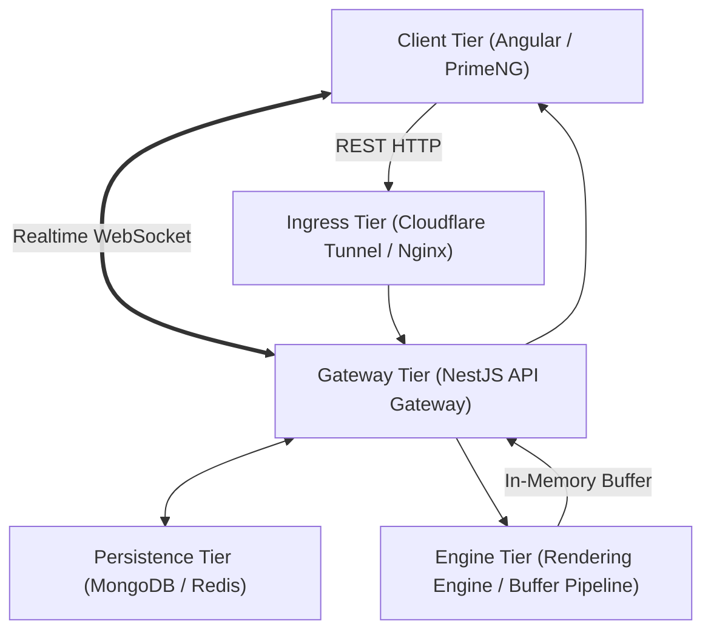

# Subsystem Architecture Specification (SAS) Pattern

**Extracted:** 2026-09-28  
**Context:** Bootstrapping and orchestrating fullstack monorepo subsystems (such as `BLIP_ARCHITECTURE.md`) spanning backend microservices, database schemas, WebSocket realtime topology, frontend micro-apps, rendering engines, and CI/CD audit gates.

## Problem
When introducing a large new capability or subsystem across a multi-tier monorepo, engineering teams and AI agents often suffer from fragmentation:
1. **Ambiguous Success Criteria:** Teams start coding without strict numerical or visual baseline tolerances, leading to regressions in document fidelity or business logic.
2. **Schema & Language Drift:** Attributes become mixed (e.g. half Indonesian, half English in database keys), breaking DTO validation, frontend data-binding, and database query predictability.
3. **Siloed Layer Development:** Backend engineers create endpoints that mismatch frontend routing; frontend engineers build UI widgets without realtime event coordination; engine developers output files instead of zero-disk memory buffers.
4. **Premature Release Leaks:** Code is committed directly to default branches (`master`) before cross-system integration, containerization, and automated audits pass.

## Solution
Before touching production code across multiple monorepo modules, author an authoritative, living root-level architecture contract (`<SUBSYSTEM>_ARCHITECTURE.md`) following the **8-Pillar Architecture Contract**:

### 1. The 8-Pillar Architecture Contract Structure

```
<SUBSYSTEM>_ARCHITECTURE.md
├── 1. Executive Summary & Absolute Success Metric (Ground Truth Parity)
├── 2. Strict Calibration Standards (Tolerances, Datasets, Dimensions)
├── 3. End-to-End Multi-Tier Topology Diagram (Mermaid)
├── 4. Database Persistence Specifications (Strict Bilingual Modeling Contract)
├── 5. Subsystem Adapter & Zero-Disk Buffer Pipeline
├── 6. Realtime Communication Protocol (WebSocket Rooms & Dual-Path Deduplication)
├── 7. Frontend Micro-App Specification (Aesthetics, Nav, Action Triggers)
├── 8. Deterministic Audit Pairing & Strict Git Quarantine Policy (No-Push to Master)
└── 9. Phased Execution Roadmap (Step-by-step phased execution)
```

---

### 2. Markdown Template: Subsystem Architecture Contract

```markdown
# [SUBSYSTEM NAME] — Comprehensive System Architecture & Specification
**Target Domain:** [subsystem.domain.tld]
**Document Status:** Living Architectural Contract
**Date:** [YYYY-MM-DD]
**Version:** [SemVer]

## 1. Executive Summary & Absolute Success Metric
- Define the core capability and absolute success criteria before writing code.
- If reproducing documents or UI, state the exact baseline: e.g. "100.0% pixel-perfect parity with 39 Ground Truth reference files".

## 2. Bilingual Data Modeling Contract
- **Schema Keys / Column Identifiers (100% English camelCase)**: `orderId`, `receiptNo`, `customerName`, `totalAmount`, `paymentMethod`.
- **Domain Values / Content Strings (100% Native Domain Language)**: `"Lunas"`, `"Tiket Bus & Shuttle"`, `"Biaya perjalanan"`.
- Prevents database corruption, preserves international schema tooling, and guarantees pristine localized presentation.

## 3. End-to-End Multi-Tier Topology
Traces data flows across all 5 monorepo tiers:


## 4. Database & DTO Specification
- Concrete TypeScript Mongoose schemas and DTOs per template or entity.
- Embed explicit index definitions, timestamps, and validation rules.

## 5. Adapter Engine: Zero-Disk Buffer Pipeline
- Prohibit writing intermediate files to disk (`/tmp`, `./scratch`) for transient operations.
- Pipe generator directly to memory buffers (`stream.PassThrough` or `Buffer.concat`) to achieve sub-second response times and zero I/O bottlenecks.

## 6. Realtime Communication Protocol
- Define Socket.IO namespaces (e.g. `/documents`), rooms (e.g. `documents:provider`), and broadcast events.
- Implement dual-path state deduplication: HTTP response updates client instantly, WebSocket synchronizes concurrent tabs.

## 7. Frontend Specification
- Establish layout archetype (e.g. Blank Canvas Dashboard, Minimalist Productivity).
- Isolate routes per provider/domain (`/generate-pdf/traveloka`, `/generate-pdf/gojek`).
- Embed direct action triggers in tables (e.g. `[ Generate ]` button in action column).

## 8. Deterministic Audit Pairing & Strict Git Release Policy
- **Audit Runner Integration**: Every claim in the specification must map to an executable check in `audit/checkers/*.py` and pass `audit_runner.py --fail-on-error`.
- **Git Quarantine Policy**: Work strictly on isolated feature branches (`feat/<subsystem>`).
- **NEVER PUSH TO MASTER**: Merge only after Tech Lead sign-off and 100% audit pass.

## 9. Phased Execution Roadmap
Decompose execution into sequential phases:
- Phase 1: Core Engine & In-Memory Streaming
- Phase 2: Database Schemas & Backend Gateway
- Phase 3: Frontend Micro-App Scaffolding & Routing
- Phase 4: Realtime CRUD Tables & Action Triggers
- Phase 5: Containerization, Testing & Automated Quality Gate
```

---

### 3. Architecture Spec Do's and Don'ts

| Aspect | DO | DON'T |
| :--- | :--- | :--- |
| **Success Metrics** | Define verifiable mathematical / visual tolerances ($\le 0.50\text{ pt}$, 100% pass) | Use vague goals like "make it look good" or "high quality" |
| **Language Standards** | Enforce English keys for code/schemas and Native strings for values | Mix languages within schema property names (`nama_user`, `orderDate`) |
| **Topology** | Trace full round-trip from Client to Ingress, Gateway, DB, and Engine | Assume backend and frontend will integrate without a documented contract |
| **Audit Pairing** | Pair each architecture pillar with an automated audit rule in `audit/` | Leave architecture as a dead document that drifts from the codebase |
| **Git Policy** | State explicit branch (`feat/<name>`) and quarantine against `master` | Allow unverified commits directly to main/master during development |

## Safety Guardrails & Operational Constraints
- **Production Guard**: Never deploy new subsystem Docker containers or migrations directly to production hosts without staging verification.
- **Explicit Approval Gating**: Always require the user or tech lead to **approve** and **confirm** any merge to the default branch (`master`) or remote deployment.
- **Audit Guard**: Block all releases and PRs unless `python audit/audit_runner.py --fail-on-error` passes with 100% compliance.

## When to Use
- Designing a new micro-frontend or sub-application in a fullstack monorepo.
- Bootstrapping a multi-tier subsystem that touches backend, database, WebSocket realtime, frontend, and rendering engines.
- Reverse-engineering complex formats where ground truth parity is the absolute success metric.
- Defining an authoritative specification before deploying autonomous agent loops or multi-developer feature teams.
